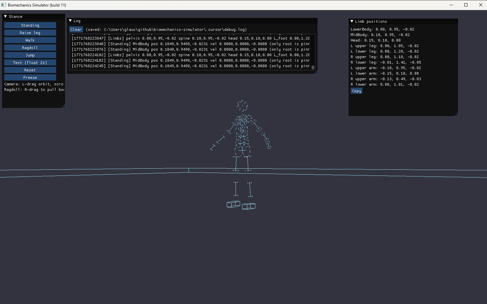
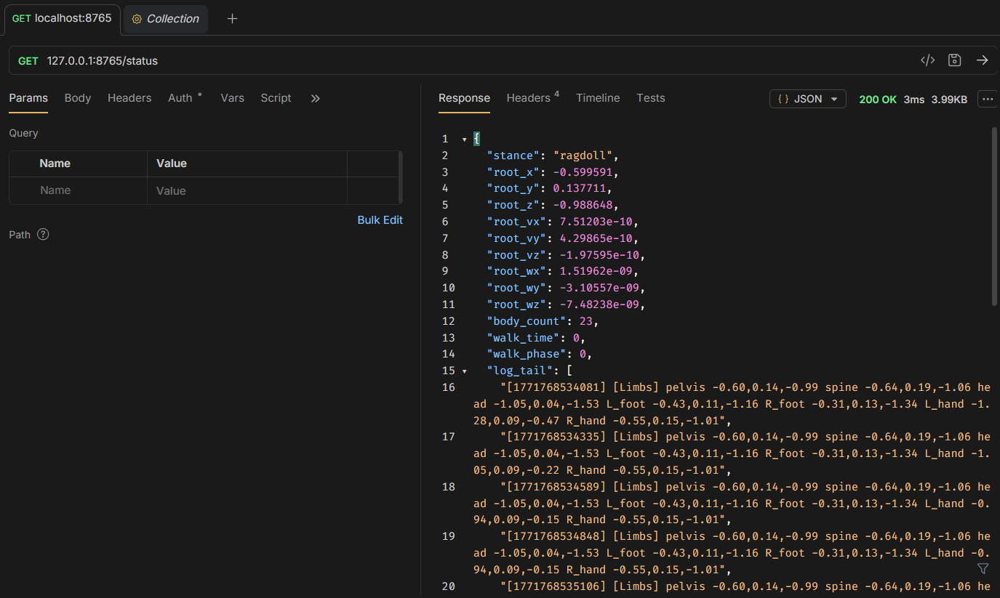

# Biomechanics Simulator (C++)

Minimal C++ biomechanics simulator with ragdoll physics using [Jolt Physics](https://github.com/jrouwe/JoltPhysics): rigid bodies (capsules for limbs), 6-DOF joint constraints, and a dynamics world. Jolt is used in Horizon Forbidden West and Death Stranding 2.





## Requirements

- **C++17** compiler (MSVC, GCC, or Clang)
- **CMake** 3.16+
- **Git** (for FetchContent; or use vcpkg)
- **GLFW** (fetched automatically via FetchContent; or from vcpkg) for the visualizer window
- **Dear ImGui** (fetched automatically via FetchContent) for the stance UI panel

## Build

**Option A – CMake only (Jolt fetched automatically)**  
From the project root:

```bash
cmake -B build
cmake --build build --config Release
```

On Windows with Visual Studio: `cmake -B build -G "Visual Studio 17 2022" -A x64` then open `build/biomechanics_simulator.sln` or run `cmake --build build --config Release`.

**Option B – vcpkg**  
Jolt is built from source via FetchContent; vcpkg is optional for other deps. If using vcpkg:

```bash
cmake -B build -DCMAKE_TOOLCHAIN_FILE=[vcpkg]/scripts/buildsystems/vcpkg.cmake
cmake --build build --config Release
```

Replace `[vcpkg]` with your vcpkg root (e.g. `C:/vcpkg` or `$HOME/vcpkg`).

## Run

From the project root, after building:

**With window (default)** – opens a GLFW/OpenGL window; close the window to exit.

```bash
# Windows (PowerShell or cmd)
.\build\Release\biomechanics_simulator.exe

# Windows Debug
.\build\Debug\biomechanics_simulator.exe

# Linux / macOS
./build/biomechanics_simulator
```

**With HTTP control** – enable the REST API on a local port (e.g. for automation or external clients):

```bash
.\build\Release\biomechanics_simulator.exe --http-port 8765   # Windows
./build/biomechanics_simulator --http-port 8765              # Linux/macOS
```

Then use `GET http://127.0.0.1:8765/status`, `PATCH http://127.0.0.1:8765/stance`, `POST http://127.0.0.1:8765/stance/punch_right`, etc. OpenAPI spec: `GET http://127.0.0.1:8765/openapi.yaml` (when run from repo root or build dir). See [docs/openapi.yaml](docs/openapi.yaml) for the full API.

**Headless** – no window; runs a fixed number of steps and prints pelvis position (for CI/automation):

```bash
.\build\Release\biomechanics_simulator.exe --headless   # Windows
./build/biomechanics_simulator --headless              # Linux/macOS
```

## Stance and movement (visualizer)

The model supports **standing**, **raise leg**, **punch** (left/right), **front kick**, **walking**, and **ragdoll**. With `assets/Human.tof` and `assets/Human/neutral.tof`, poses are driven by **kinematics** on the file rig; a procedural 12-bone fallback is used when those assets are missing.

<<<<<<< HEAD
- **Standing** – Pose control holds the ragdoll upright (default when the window opens). Root is pinned.
- **Raise leg** – Static stance with one leg raised; root pinned, other limbs driven by motors.
- **Walking** – Cyclic gait: hip/knee/arm targets drive a walking motion.
- **Ragdoll** – No pose control; full physics.
- **Jump** – Bends knees (crouch ~0.2 s), launches upward, ragdoll in the air, then **auto-recovers to Standing** on landing.
=======
| Mode | Description |
|------|-------------|
| **Standing** | Neutral pose sampled from `neutral.tof`; root XZ pinned. Default on launch. |
| **Raise leg** | Right leg raised with slight torso lean; root pinned. |
| **Punch R / Punch L** | Forward punch with one arm; opposite arm in guard. Mirror poses (same joint deltas, sides swapped). |
| **Front kick** | Right-leg kick forward; arms in guard; root pinned. |
| **Walking** | `walk.tof` animation (or procedural gait); kinematic drive, optional forward drift. |
| **Ragdoll** | Full physics; no pose hold. Right-drag to pull bodies. |
| **Jump** | Brief crouch, then upward launch; auto-recovers to **Standing** at landing XZ. |
>>>>>>> b8969e3 (Update README to enhance clarity on build commands and stance capabilities)

**Stance panel (top-left):** **Standing**, **Raise leg**, **Punch R**, **Punch L**, **Front kick**, **Walk**, **Ragdoll**, **Jump**, **Reset**, **Test (float 2s)**, **Freeze/Unfreeze**.

**Keys (with window focused):**

| Key | Action |
|-----|--------|
| **1** | Standing |
| **2** | Walking |
| **3** | Ragdoll |
| **4** | Raise leg |
| **5** | Punch R |
| **6** | Punch L |
| **7** | Front kick |
| **Space** | Jump |

**Camera:** Left mouse drag to orbit; scroll to zoom. In **Ragdoll**, right-drag pulls a limb toward the cursor.

Pose timing and angles are tunable in `include/biomechanics/Config.hpp` (`action_pose_duration`, `punch_*`, `kick_*`, `raise_leg_*`, jump crouch, walk playback, etc.).

## HTTP stance API (summary)

When `--http-port` is set, stance can be set via `PATCH /stance` with JSON `{"stance": "..."}` or dedicated `POST` routes:

| Stance value | POST route |
|--------------|------------|
| `standing` | `/stance/standing` |
| `standing_raise_leg` | `/stance/standing_raise_leg` |
| `punch_right` | `/stance/punch_right` (alias: `/stance/fist`) |
| `punch_left` | `/stance/punch_left` |
| `front_kick` | `/stance/front_kick` |
| `walking` | `/stance/walking` |
| `ragdoll` | `/stance/ragdoll` |

Other actions: `POST /jump`, `POST /reset`, `PATCH /position`, `GET /status`, `GET /log`.

## What it does

- Creates a Jolt `PhysicsSystem` with gravity.
- Adds a ground plane and a human ragdoll from `assets/Human.tof` when present (else a procedural capsule rig).
- Loads `assets/Human/neutral.tof` and `assets/Human/walk.tof` for standing and walking when available.
- **Default:** real-time visualizer with wireframe rendering; starts in **Standing**.
- **Pinned stances** (standing, raise leg, punches, kick): root XZ and rotation anchored; limbs driven each frame before physics.
- **`--http-port PORT`:** local REST server for stance, status, log, position, and actions.
- **`--headless`:** fixed step count, no window; useful for CI.

## Project layout

- `CMakeLists.txt` – root build; Jolt, GLFW, ImGui (FetchContent); `biomechanics_simulator`, optional tests.
- `vcpkg.json` – vcpkg manifest (optional).
<<<<<<< HEAD
- `include/biomechanics/` – public API: `Config.hpp`, `HttpControl.hpp`, `JoltLayers.hpp`, `Log.hpp`, `PoseController.hpp`, `ShapeWireframeSupport.hpp`, `Simulator.hpp`, `SimulatorScene.hpp`, `Visualizer.hpp`, `OpenGLDebugDrawer.hpp`, etc.
- `src/main.cpp` – entry point; parses `--headless`, `--http-port`, calls `run_demo_visual()` (default) or `run_demo()`.
- `src/PoseController.cpp` – stance logic: standing, standing raise-leg, walking, ragdoll; jump impulse.
- `src/Visualizer.cpp` – GLFW window, orbit camera, ImGui stance panel, key bindings (1–4, Space), step-and-draw loop.
- `src/HttpControl.cpp` – HTTP server: `/status`, `/log`, `/stance`, `/stance/standing`, `/stance/standing_raise_leg`, `/stance/walking`, `/stance/ragdoll`, `/jump`, `/reset`, `/position`, `/openapi.yaml`.
- `src/SimulatorScene.cpp` – scene setup (ground, ragdoll from Human.tof or procedural).
- `src/HumanRagdoll.cpp` – Human.tof loading, procedural human rig.
- `src/OpenGLDebugDrawer.cpp` – wireframe rendering of Jolt bodies.
- `docs/openapi.yaml` – OpenAPI 3.0 spec for the HTTP API.
- `docs/PROJECT_STRUCTURE.md`, `docs/MILESTONES.md` – layout and milestones.
- `tests/` – optional tests; enabled by default (`BUILD_TESTS=ON`, disable with `-DBUILD_TESTS=OFF`).
=======
- `assets/` – `Human.tof`, `Human/neutral.tof`, `Human/walk.tof` (copy from Jolt Physics assets if needed).
- `include/biomechanics/` – `Config.hpp`, `PoseController.hpp`, `HttpControl.hpp`, `SimulatorScene.hpp`, `Visualizer.hpp`, etc.
- `src/main.cpp` – entry point; `--headless`, `--http-port`.
- `src/PoseController.cpp` – standing, walk, raise leg, punch L/R, front kick, jump crouch/launch/landing recovery.
- `src/Visualizer.cpp` – GLFW, ImGui stance panel, camera, keys 1–7 and Space.
- `src/HttpControl.cpp` – HTTP server and stance/action endpoints.
- `src/SimulatorScene.cpp` – scene setup (ground, ragdoll, animations).
- `src/HumanRagdoll.cpp` – Human.tof loading and procedural rig fallback.
- `docs/openapi.yaml` – OpenAPI 3.0 spec for the HTTP API.
- `docs/PROJECT_STRUCTURE.md`, `docs/DEBUG_WALKING.md` – layout and tuning notes.
- `tests/` – optional tests; build with `-DBUILD_TESTS=ON`.
>>>>>>> b8969e3 (Update README to enhance clarity on build commands and stance capabilities)

## License

See [LICENSE](LICENSE).
